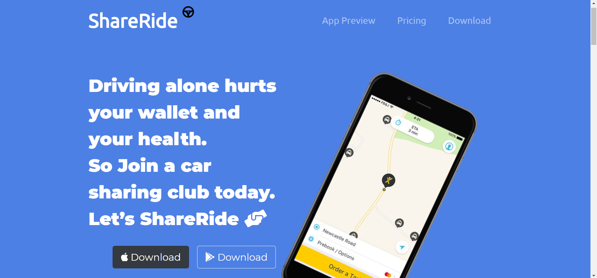
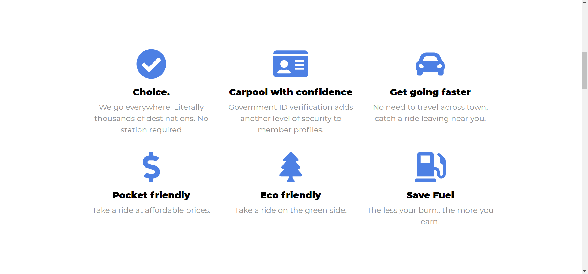
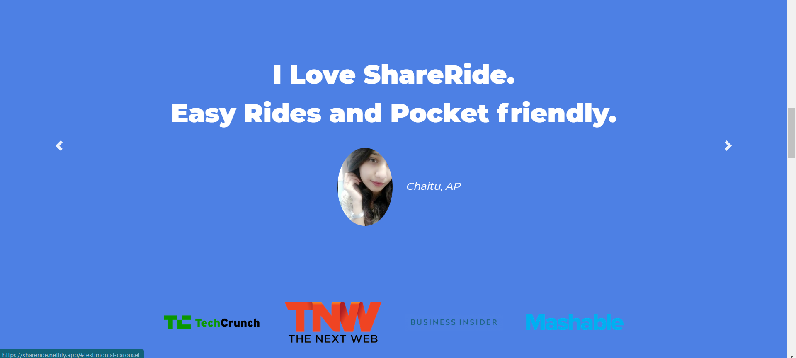
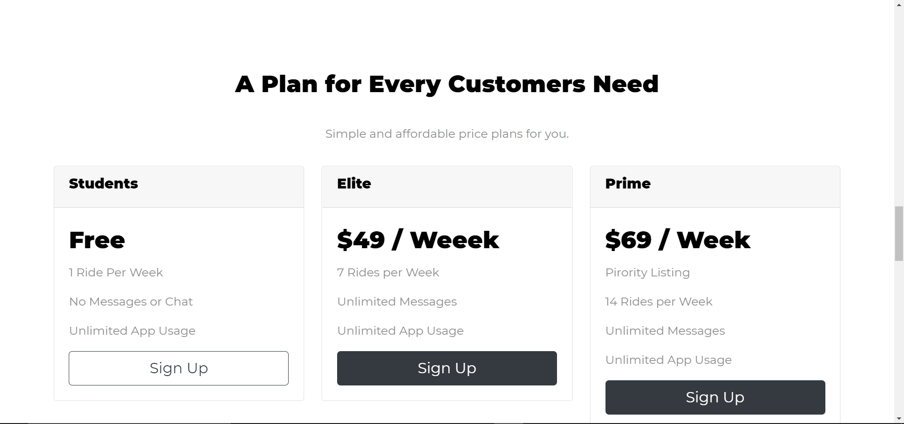
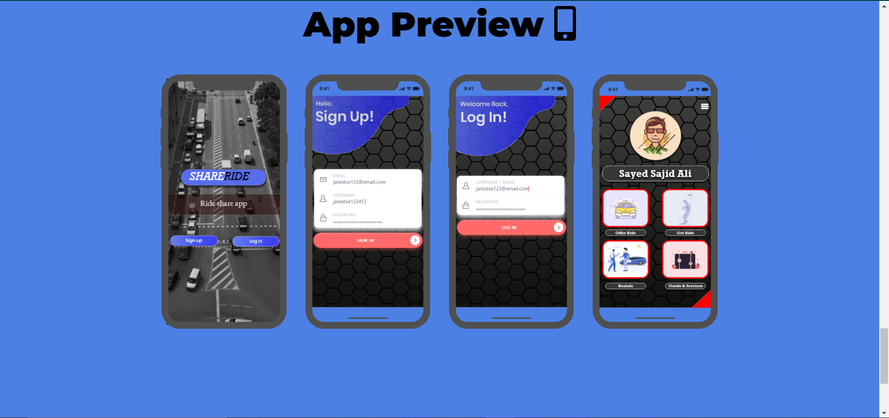

# ShareRide_Webpage
Webpage for an android app made by me and my team for a Hackathon event sponsored by GeeksForGeeks.

App made using Android Studios.
Designed UI using AdobeXD and Figma 

WebSite Designed using Bootstrap, HTML, CSS

<b>WebSite and App Preview</b>

